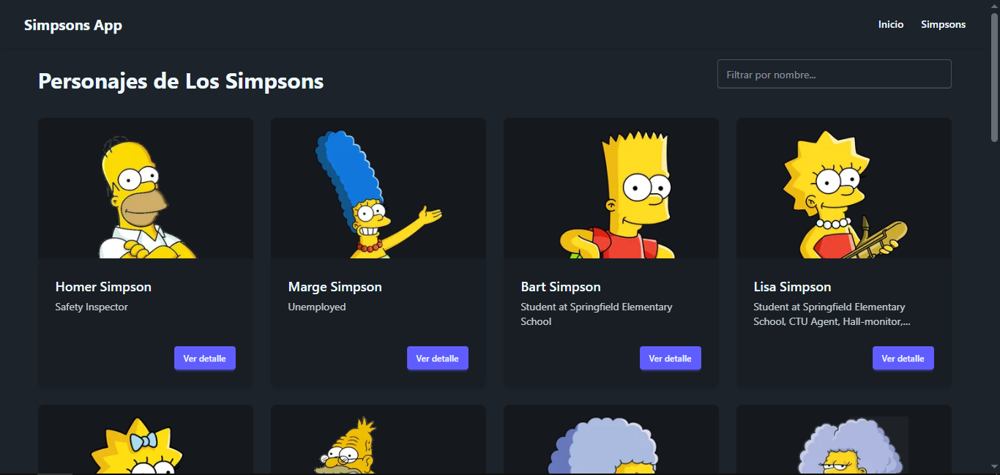
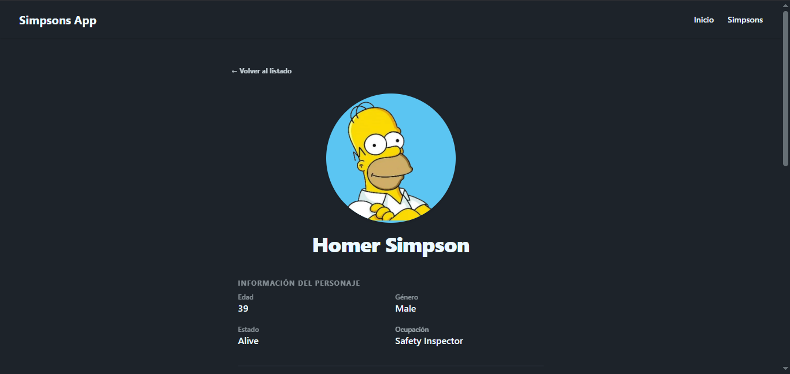

# App de los Simpsons con Vue

<div align="center">
  <p>
    <b>Explora el universo de Springfield desde tu navegador.</b><br>
    Una aplicación web moderna desarrollada para consumir la API oficial de Los Simpsons con una interfaz fluida, rápida y temática.
  </p>
  <p>
    
    
    
    
    
  </p>
  <p>
    • <a href="https://thesimpsonsapi.com/#docs" target="_blank">Documentación de la API</a>
  </p>
</div>

---

## Captura de pantalla

|        **Lista de personajes**         |   **Detalle del personaje**    |
| :------------------------------------: | :----------------------------: |
|  |  |

## 📖 Descripción del Proyecto

**The Simpsons App** es una SPA (Single Page Application) desarrollada con **Vue 3** y el empaquetador **Vite**. Permite navegar a través del catálogo completo de personajes de la icónica serie de los simpsons, ver información detallada de cada uno, filtrar en tiempo real por nombre".

---

## 🚀 Funcionalidades Principales

- **Listado y Paginación:** Visualización de personajes obtenidos de la API oficial ordenados por páginas.
- **Buscador en Tiempo Real:** Filtrado dinámico de personajes de manera local sobre los registros actuales.
- **Vista de Detalle:** Acceso a información específica e individual de cada personaje de Springfield.
- **Manejo de Errores :** Pantalla de error amigable cuando la API esta mal escrita o ya no esta disponible.
- **Diseño Responsivo:** Interfaz adaptada a dispositivos móviles, tablets y escritorios gracias a **Tailwind CSS** y **DaisyUI**.

---

## 🛠️ Stack Tecnológico

Construido con herramientas modernas del ecosistema frontend para garantizar velocidad y una excelente experiencia de desarrollo (DX).

| Tecnología                  |                                                     Insignia                                                      | Uso                                      |
| :-------------------------- | :---------------------------------------------------------------------------------------------------------------: | :--------------------------------------- |
| **Vue 3 (Composition API)** |                   | Framework progresivo y reactivo.         |
| **Vite**                    |                      | Entorno de desarrollo y empaquetador.    |
| **Vue Router**              |    | Enrutamiento de páginas (SPA).           |
| **Axios**                   |                   | Cliente HTTP para peticiones a la API.   |
| **Tailwind CSS**            |  | Framework CSS utility-first.             |
| **DaisyUI**                 |             | Biblioteca de componentes para Tailwind. |

---

## 📂 Estructura del Proyecto

Organización modular dentro de la carpeta `src/`:

```bash
vue-the-simpsons/
├── public/              # Archivos estáticos globales (imágenes 404, etc.)
├── docs/                # Documentación e imágenes de previsualización
├── src/
│   ├── assets/          # Recursos estáticos locales
│   ├── components/      # Componentes reutilizables (Spinner, Paginación, Buscador)
│   ├── helpers/         # Funciones de utilidad (Manejador de errores)
│   ├── router/          # Configuración de rutas de Vue Router
│   ├── services/        # Conexión con The Simpsons API (Axios)
│   ├── views/           # Vistas principales de la aplicación (Home, Detail, 404)
│   ├── App.vue          # Componente raíz
│   └── main.js          # Punto de entrada de la app
├── index.html           # Plantilla HTML principal
├── package.json         # Dependencias y scripts de Vite
└── vite.config.js       # Configuración de Vite

```

## ⚙️ Instalación y Configuración Local

Sigue estos pasos para clonar y ejecutar el proyecto en tu máquina local.

```sh
git clone https://github.com/yassppy/vue-the-simpsons # clonar el repo
bun install #Instalar dependencias
bun run dev # Ejecutar el servidor
bun run build # Generar el compilador para producción
```

## 👥 Equipo

<table>
  <tr>
    <align="center">
      <a href="https://github.com/yassppy" target="_blank">
        <br />
        <sub><b>Miguel Mallqui</b></sub>
      </a>
    </td>
  </tr>
</table>
